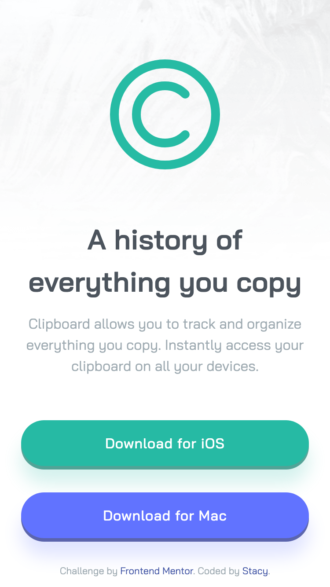

# Frontend Mentor - Clipboard landing page solution

This is a solution to the [Clipboard landing page challenge on Frontend Mentor](https://www.frontendmentor.io/challenges/clipboard-landing-page-5cc9bccd6c4c91111378ecb9). Frontend Mentor challenges help you improve your coding skills by building realistic projects.

### The challenge

Users should be able to:

- View the optimal layout for the site depending on their device's screen size
- See hover states for all interactive elements on the page

### Screenshot

### Links

- Live Site URL: [Live Site](https://clipboard-landing-page-stacy.netlify.app/)

### Built with

- Semantic HTML5 markup
- CSS custom properties
- Flexbox
- CSS Grid

### What I learned

This is my first landing page. What I would do differently next time is I would start with a plan and set up as this took longer to complete than I expected. For instance, implementing the footer section was particularly challenging as there were many ways to tackle it, and especially deciding on breakpoints and adjustments. Additionally, figuring out how to implement the hover color effect on the social links took some creative problem solving. Through this process, I learned about the filter property and used a filter generator to achieve the desired effect.

## Author

- Frontend Mentor - [@stautuan](https://www.frontendmentor.io/profile/stautuan)
